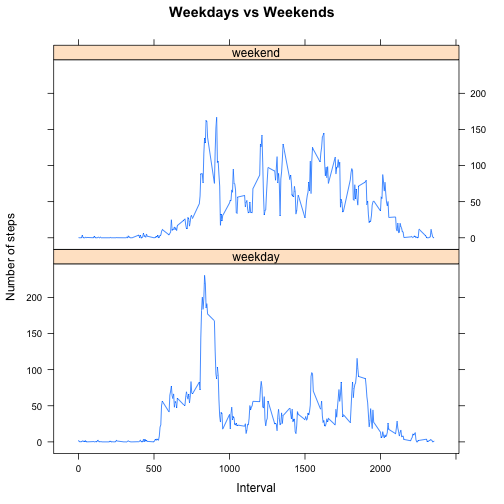

## Loading and preprocessing the data


```r
library(dplyr)
library(lattice)
library(grid)
DF1 <- read.csv("activity.csv")
DF2 <- na.omit(DF1)
```

## What is mean total number of steps taken per day?


```r
DF3 <- group_by(DF2,date)
DF4 <- summarise(DF3, steps = sum(steps))
hist(DF4$steps, xlab ="Steps", main="Total number of steps taken each day (missing values omitted)")
```

 

```r
DF5 <- mean(DF4$steps)
DF6 <- median(DF4$steps)
DFm <- as.character(round(DF5, 2))
```

The mean is 10766.19 and the median is 10765.


## What is the average daily activity pattern?


```r
DF7 <- group_by(DF2, interval)
DF8 <- summarise(DF7, steps = mean(steps))
DF9 <- data.frame(tel = 0:287, DF8)

with(DF9, plot(tel, steps, type = "l", xaxt = "n", xlab="Interval", ylab="Number of steps", main="Time series plot of the average steps per interval"))
ticks <- c("00:00", "06:00", "12:00","18:00", "23:55")
axis(1,at=c(0,73,145,217,287),labels=ticks)
```

 

```r
DFmax <- summarise(DF8, steps = max(steps))
DFintmax <- DF8[grep(DFmax, DF8$steps), ]
```

The interval with the maximimum number of steps:

```r
DFmax <- summarise(DF8, steps = max(steps))
DFintmax <- DF8[grep(DFmax, DF8$steps), ]
print(DFintmax)
```

```
## Source: local data frame [1 x 2]
## 
##   interval    steps
## 1      835 206.1698
```

To make it more clear. The 5 minute interval with the maximum number of steps is 08:35 - 08:40.

## Imputing missing values


```r
x <- as.numeric(is.na(DF1))
y <- sum(x)
```

The number of missing values: 2304

I replaced (imputed) the missing values with the average average number of steps taken, averaged across all days.


```r
DFimp2 <- DF1

for (i in 1:length(DFimp2$steps)) {
        if (is.na(DFimp2$steps[i]) == TRUE ){
               
                DFimp2$steps[i] <- subset(DF8, interval == DFimp2$interval[i], select = steps)
        }
        
       
        
}
DFimp2$steps <- unlist(DFimp2$steps)
DFimp3 <- group_by(DFimp2,date)
DFimp4 <- summarise(DFimp3, steps = sum(steps))
DFimp5 <- mean(DFimp4$steps)
DFimp6 <- median(DFimp4$steps)
DFmean <- as.character(round(DFimp5, 2))
DFmedian <- as.character(round(DFimp6, 2))
hist(DFimp4$steps, xlab="Interval", ylab="Number of steps", main="Total number of steps taken each day with missing values imputed")
```

 

The mean with the missing values imputed: 10766.19
The median with the missing values imputed: 10766.19

The mean is the same as the mean of the data without the missing data.
The median is different.

Without the missing values: 10765 

With the missing values imputed: 10766.19

The impact on the data with the missing values imputed is mostly on the  range from 10000 - 15000 steps. The frequency is higher for the data with the
missing values imputed. See both histograms.

## Are there differences in activity patterns between weekdays and weekends?

```r
#3 turn it into factor variables
DFimp2$date <- as.Date(DFimp2$date, "%Y-%m-%d")
DFimp2$date <- weekdays(DFimp2$date)
DFimp2$date <- factor(DFimp2$date)
levels(DFimp2$date)[1:5] <- "weekdays"
levels(DFimp2$date)[2:3] <- "weekend"

DFweek <- DFimp2[grep("weekdays", DFimp2$date), ]
DFwknd <- DFimp2[grep("weekend", DFimp2$date), ]

DFweek2 <- group_by(DFweek, interval)
DFweek3 <- summarise(DFweek2, steps = mean(steps))
DFwknd2 <- group_by(DFwknd, interval)
DFwknd3 <- summarise(DFwknd2, steps = mean(steps))

#Because I lose the date column after summarise I included a new column with weekday and weekend
DFweek4 <- data.frame(days = rep("weekday", 288), DFweek3)
DFwknd4 <- data.frame(days = rep("weekend", 288), DFwknd3)
DFdays <- rbind(DFweek4, DFwknd4)

#plot the data
xyplot(steps ~ interval | days,
       data=DFdays,
       main="Weekdays vs Weekends",
       ylab="Number of steps", xlab="Interval",
       type="l", layout=c(1,2))
```

 
